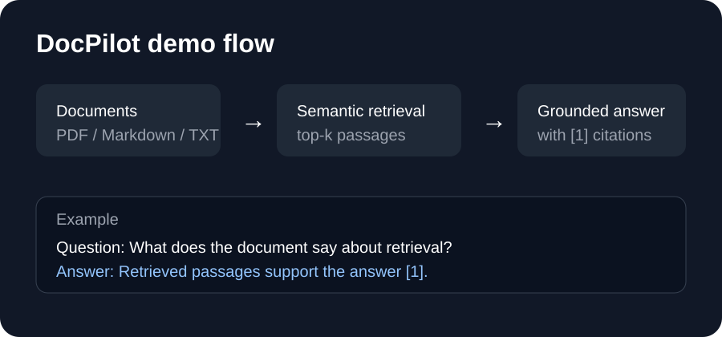

# DocPilot

[](https://github.com/Jeevan-u/docpilot/actions/workflows/ci.yml)

**DocPilot** is a small retrieval-augmented generation (RAG) application for asking questions about your own PDFs, Markdown files, and text documents. It retrieves relevant passages first, then generates an answer grounded only in those passages and cites the sources.

## Demo



## Problem statement

Large documents can make manual search slow, while a general-purpose LLM can produce an answer without being grounded in the source material. DocPilot addresses this by combining semantic retrieval with source-grounded generation.

## What I built

- Token-aware chunking with overlap
- OpenAI embeddings
- A lightweight NumPy cosine-similarity vector store
- Top-k retrieval
- Source-grounded answer generation with citations
- Offline retrieval evaluation
- A Streamlit web interface for uploading documents and asking questions

## Architecture

```
Documents
   ↓
Loader → Token-aware chunker → Embeddings
                                  ↓
                           NumPy vector store
                                  ↓
Question → Retriever → Top-k passages → LLM
                                      ↓
                              Answer + sources
```

## Deployment

The repository includes `render.yaml` for a Render web service.

**Public deployment:** pending final hosting connection and `OPENAI_API_KEY`.

After deployment, put the public service URL here:

```
https://<your-render-service>.onrender.com
```

## Local setup

Requires Python 3.10+.

```bash
git clone https://github.com/Jeevan-u/docpilot.git
cd docpilot
python3 -m venv .venv
source .venv/bin/activate
pip install -r requirements.txt
cp .env.example .env
```

Add your `OPENAI_API_KEY` to `.env`.

### CLI

```bash
python main.py index sample_docs
python main.py ask "What is retrieval-augmented generation?"
```

### Streamlit app

```bash
streamlit run app.py
```

Upload PDF, Markdown, or text files, build the index, and ask questions from the uploaded content.

## Evaluation

```bash
python main.py eval --questions eval_questions.json
```

The benchmark reports retrieval hit-rate and can optionally measure answer coverage with `--generate-answers`.

## Project structure

```
docpilot/
├── app.py
├── main.py
├── render.yaml
├── docpilot/
├── sample_docs/
└── tests/
```

## Next improvements

- Hybrid BM25 + semantic retrieval
- Reranking of top-k candidates
- Local embeddings with sentence-transformers
- Persistent vector storage for deployed sessions
- Streaming responses

## Tests

```bash
pip install -r requirements-dev.txt
pytest
```

## License

MIT
